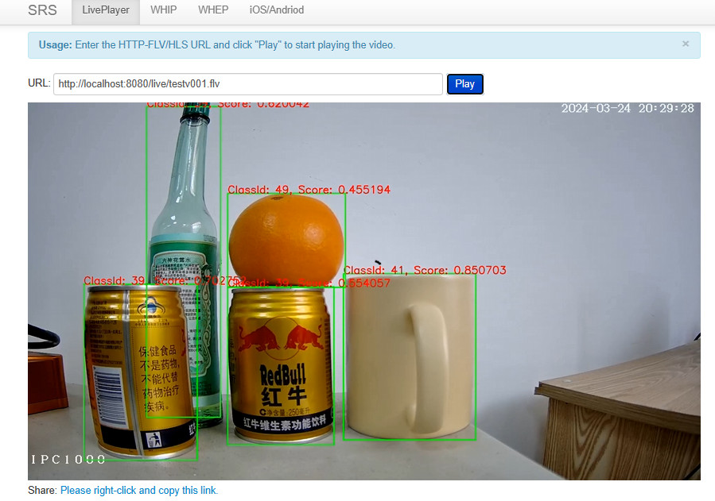
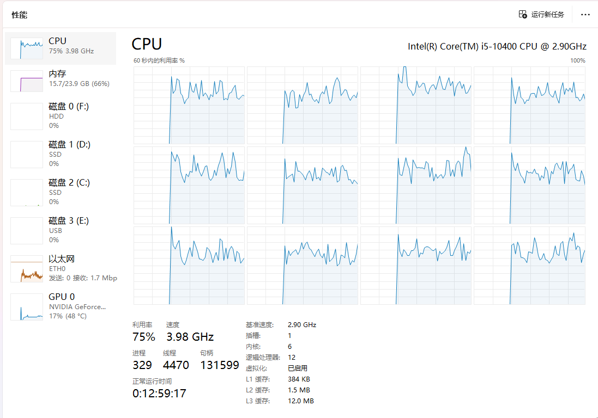

<!--
 Copyright (C) 2024 wwhai

 This program is free software: you can redistribute it and/or modify
 it under the terms of the GNU Affero General Public License as
 published by the Free Software Foundation, either version 3 of the
 License, or (at your option) any later version.

 This program is distributed in the hope that it will be useful,
 but WITHOUT ANY WARRANTY; without even the implied warranty of
 MERCHANTABILITY or FITNESS FOR A PARTICULAR PURPOSE.  See the
 GNU Affero General Public License for more details.

 You should have received a copy of the GNU Affero General Public License
 along with this program.  If not, see <https://www.gnu.org/licenses/>.
-->

# GoCV Yolo8示例
用Gocv的DNN模块来运行Yolo8，然后实现标记，最后推向SRS服务器。虽然流程实现了，但是经过实测效果不是很好，纯CPU计算掉帧厉害，每秒5FPS实属是3GP时代。
## 效果

## 总结
虽然说效果不是很好，但是具备研究意义，尤其Opencv4.8自带的DNN模块值得把玩。